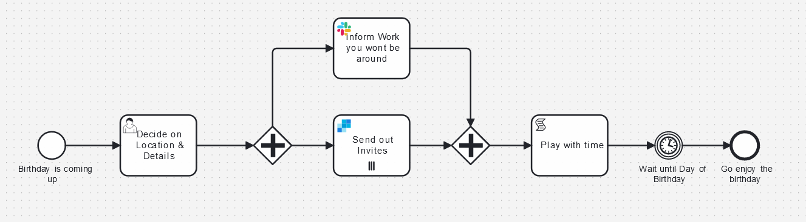

# Birthday Invite Example

Using Camunda and BPMN, I have built an example of a process for sending birthday invites. The purpose is to demonstrate how to integrate with Slack and SendGrid to send messages, with a little bonus of using multi-instance markers to send multiple emails.

## Setup Required

This example requires a little bit of setup. You will need a Camunda 8 account (the easiest place to do that is [Camunda SaaS](https://signup.camunda.com/accounts)). You will also need to create a [SendGrid](https://sendgrid.com/en-us) account and you need to create a [Slack](https://slack.com/) Account. Then, you need to get an API key for both services.

## Setting up Secrets

🔐 It’s important to know that it’s best practice not to simply copy and paste this sensitive information directly into the model but rather to [create a secret](https://docs.camunda.io/docs/components/console/manage-clusters/manage-secrets/) for each of these in your Camunda cluster. Then you can reference it by typing `{{secrets.yourSecretHere}}` followed by the name of the key you want to access.

For this example to work you'll need to create secrets with the following names:

- HawkSlack
- SendGrid

## How to Deploy it

Once you have both accounts, it's pretty easy to get started. Upload the BPMN model and the Forms from their respective folders and add them to your Camunda 8 account. From the modeler you can deploy the process to a cluster.

You can start the process from the Modeler or from Tasklist.
